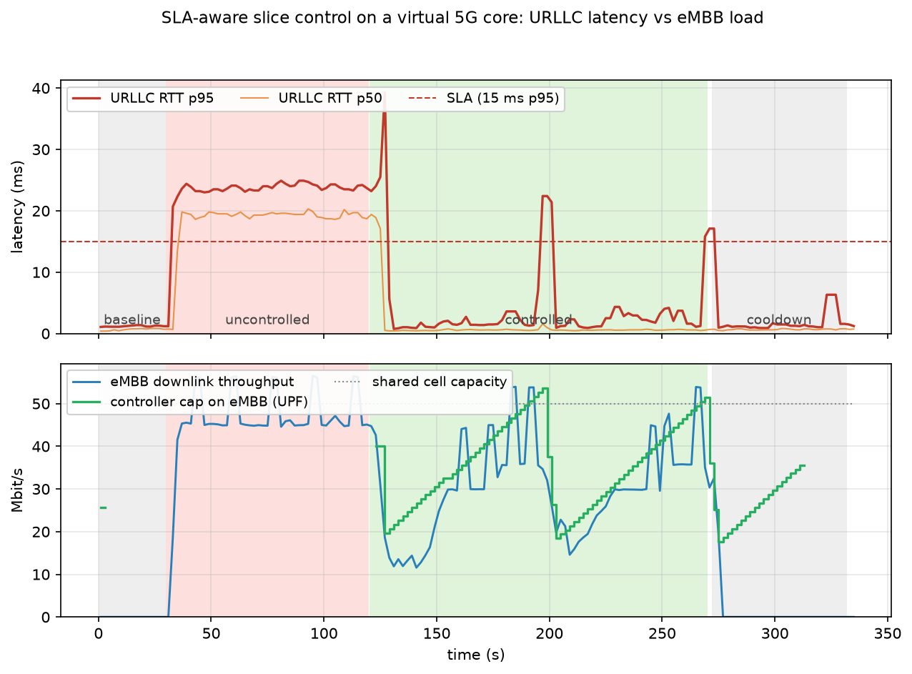

# 5gs-monitor

SLA-aware monitoring and orchestration loop for a **sliced virtual 5G core on Kubernetes**.

Two network slices (eMBB and URLLC) run on an [Open5GS](https://open5gs.org) core with a UERANSIM
RAN, each slice with its own SMF/UPF pair. Per-slice KPIs — latency, throughput, reliability — are
measured end to end through the PDU sessions and scraped into Prometheus next to the core's own
counters. A closed-loop controller watches the URLLC slice's SLA and, when an eMBB download starts
inflating its latency in the shared cell, throttles the eMBB slice at its UPF just enough to bring
URLLC back inside its budget, then hands the capacity back (AIMD) as soon as it can.



*Uncontrolled, a 46 Mbit/s eMBB download pushes the URLLC slice's p95 RTT from 1.2 ms to 24 ms
(SLA: 15 ms) for 98 % of the phase. With the controller on, URLLC's median p95 is 1.8 ms and it is
inside the SLA 89 % of the time (the two dips are AIMD probing past the cell rate), while eMBB
still gets 31 Mbit/s on average. Run: `results/latest`.*

## What runs

```
                 ┌──────────── Kubernetes (OrbStack, single node, arm64) ────────────┐
                 │  namespace 5gs                                                    │
 UE eMBB ──┐     │   gnb ─────► AMF ─► NRF/SCP/NSSF/AUSF/UDM/UDR/PCF/BSF ─► MongoDB  │
 (+probe)  ├─ RLS┤   (UERANSIM) │                                                    │
 UE URLLC ─┘     │              ├─► smf (embb)  ─► upf (embb)  ─[shaper]─┐           │
 (+probe)        │              └─► smf-urllc   ─► upf-urllc  ───────────┼─► app-server (iperf3)
                 │                                                        │           │
                 │   controller ◄─── Prometheus ◄─── probes, NF exporters, shapers    │
                 │                                                                    │
                 │  namespace monitoring: kube-prometheus-stack (Prometheus, Grafana) │
                 └────────────────────────────────────────────────────────────────────┘
```

| Piece | Where | Notes |
| --- | --- | --- |
| 5G core | `deploy/core/` | Gradiant Open5GS Helm charts (vendored as a submodule), 2.7.2 images (last arm64 build). 4G/EPC off. Own `mongo:7` (the Bitnami chart has no arm64 images any more). |
| Slices | `deploy/core/open5gs-values.yaml`, `*-urllc-values.yaml` | eMBB `sst=1 sd=000001 dnn=embb 10.45/16`, URLLC `sst=2 sd=000002 dnn=urllc 10.46/16`. AMF/NSSF advertise both; each SMF carries an `info` block so the AMF picks the right one per S-NSSAI/DNN. |
| Subscribers | `src/fivegs_monitor/provision.py` | Written straight into MongoDB with per-slice QoS (URLLC 5QI 5 / ARP 1, eMBB 5QI 9 / ARP 8). |
| RAN | `deploy/ran/` | UERANSIM gNB serving both slices; one UE Deployment per slice. |
| KPI probe | `src/fivegs_monitor/probe.py` | Sidecar in each UE pod: pins the app server behind `uesimtun0`, then pings it (RTT quantiles, loss) and reads the tunnel byte counters (throughput). `:9100`. |
| Cell model | `shaper` sidecar on the gNB | UERANSIM has no radio resource model, so the shared cell is a 50 Mbit/s HTB + 300-packet FIFO on the gNB's downlink radio-link traffic. This is what both slices contend for. |
| Actuator | `shaper` sidecar on the eMBB UPF | Same agent on the eMBB UPF's `ogstun`: caps the slice's downlink at the user plane. `PUT /rate`. |
| Controller | `src/fivegs_monitor/controller.py`, `deploy/controller/` | Reads KPIs from Prometheus every 2 s, compares with `policy.yaml`, actuates. Breach → multiplicative decrease of the eMBB cap; healthy → additive increase; slack cap → released. A linear RTT trend over the last 10 s holds the cap when a breach is forecast within 6 s. |
| Monitoring | `deploy/monitoring/` | kube-prometheus-stack; ServiceMonitor for the Open5GS exporters (needs `fallbackScrapeProtocol`, they send no Content-Type), PodMonitors for probes/shapers/controller, Grafana dashboard. |
| Experiment | `experiments/run.py`, `plot.py` | baseline → uncontrolled load → controlled load → cooldown; writes `results/<stamp>/kpis.csv` + `sla_loop.png`. |

## Bring-up

Needs Docker + Kubernetes (OrbStack on macOS: `orb config set k8s.enable true`), `helm`, `kubectl`, `uv`.

```sh
git clone --recurse-submodules https://github.com/vdesmond/5gs-monitor && cd 5gs-monitor
make up          # monitoring → image → core (+ subscribers) → RAN → controller, ~3 min
make status      # both UEs should report "TUN interface[uesimtun0, 10.4x.0.x] is up"
make grafana     # http://localhost:3000, dashboard "5gs-monitor: slice SLA"
make experiment  # ~6 min A/B run
make plot
```

Only Kubernetes-native things are needed: the whole thing is Deployments, Services, ConfigMaps,
Helm values and two PodMonitors. `make down` removes the `5gs` namespace.

## How the loop behaves

`policy.yaml`:

```yaml
protected:   {slice: urllc, rtt_p95_ms: 15, loss_ratio: 0.01, trend_window_s: 10, predict_horizon_s: 6}
best_effort: {slice: embb, start_mbit: 40, decrease_factor: 0.7, increase_mbit: 1, floor_mbit: 2, release_after_s: 30}
```

* **Breach** (URLLC p95 > 15 ms or loss > 1 %): cap eMBB at 40 Mbit/s if uncapped, else cap × 0.7.
* **Predicted breach** (RTT trend crosses the SLA within 6 s): hold the cap.
* **Healthy**: cap + 1 Mbit/s per period — the eMBB slice probes back up until URLLC complains again.
* **Slack** (eMBB throughput < ½ cap for 30 s): drop the cap.

The result is the classic AIMD sawtooth in the plot: eMBB ramps until it hurts URLLC, gets cut
back, ramps again. The URLLC excursions last one or two control periods each; a smaller
`increase_mbit` or a longer `predict_horizon_s` trades eMBB throughput for fewer of them.

## Honest scope

* This is **orchestration at the core / telco-cloud layer** — the lever is the user plane, not the
  scheduler. UERANSIM has no PRBs to allocate; the "cell" is a shaped FIFO. A real gNB would give
  URLLC a scheduling priority the FIFO does not, which is exactly why a closed loop is needed here.
* The Open5GS exporters give control-plane counters (registrations, sessions, QoS flows, N3 volume);
  the latency/throughput/loss KPIs come from the probes.
* The controller only acts on the eMBB slice. Scaling the URLLC UPF or rewriting Session-AMBR via
  the PCF would be the next levers; both are straightforward from the same loop.

## Layout

```
deploy/            Kubernetes manifests and Helm values, one directory per plane
src/fivegs_monitor one Python package, one subcommand per container role
experiments/       A/B runner and plot
results/           committed runs
third_party/       Gradiant/5g-charts submodule
```
